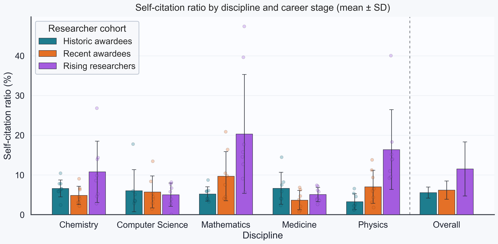
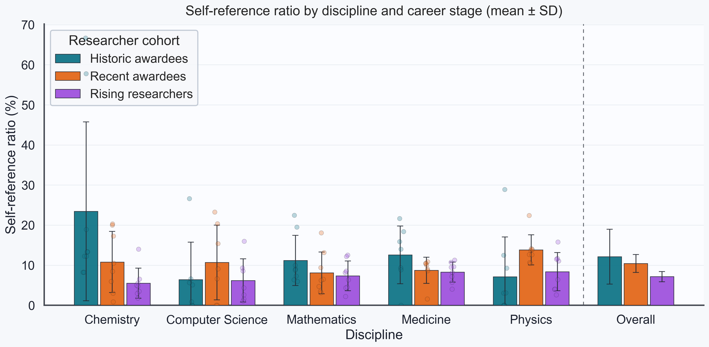

[](https://github.com/jannisborn/paperscraper/actions/workflows/test_tip.yml?query=branch%3Amain)
[](https://github.com/jannisborn/paperscraper/actions/workflows/test_pypi.yml?query=branch%3Amain)
[](https://jannisborn.github.io/paperscraper/)
[](https://opensource.org/licenses/MIT)
[](https://badge.fury.io/py/paperscraper)
[](https://pepy.tech/project/paperscraper)
[](https://codecov.io/github/jannisborn/paperscraper)
# paperscraper

`paperscraper` is a `python` package for scraping publication metadata or full text files
(PDF or XML) from
[PubMed](https://pubmed.ncbi.nlm.nih.gov/) or preprint servers such as
[arXiv](https://arxiv.org/), [medRxiv](https://www.medrxiv.org/),
[bioRxiv](https://www.biorxiv.org/), and [chemRxiv](https://chemrxiv.org/).
It provides a streamlined interface to scrape metadata, retrieve citation counts
from [Google Scholar](https://scholar.google.com/), query journal impact factors,
and run simple postprocessing and plotting routines for meta-analysis.

## Table of Contents

1. [Getting Started](#getting-started)
   - [Download xRxiv Dumps](#download-xrxiv-dumps)
   - [arXiv Local Dump](#arxiv-local-dump)
2. [Examples](#examples)
   - [Paper Keyword Analysis](#paper-keyword-analysis)
   - [PDF Retrieval](#pdf-retrieval)
   - [Scholar Metrics Analysis](#scholar-metrics-analysis)
   - [Self-Citation Analysis](#self-citation-analysis)
3. [Citation](#citation)
4. [Contributors](#contributors)

## Getting started

```console
pip install paperscraper
```

or, with [uv](https://docs.astral.sh/uv/):

```console
uv add paperscraper
```

This is enough to query [PubMed](https://pubmed.ncbi.nlm.nih.gov/),
[arXiv](https://arxiv.org/) or [Google Scholar](https://scholar.google.com/).

### Local development

```console
uv sync
```

This installs the project and dev tooling into `.venv`. Use `uv run` to execute commands, for example:

```console
uv run python -c "import paperscraper"
```

#### Download xRxiv Dumps

However, to scrape publication data from the preprint servers [bioRxiv](https://www.biorxiv.org),
[medRxiv](https://www.medrxiv.org/) and [chemRxiv](https://chemrxiv.org/), the setup is
different. The entire history of papers is downloaded and stored in the `server_dumps`
folder in JSONL format (one paper per line).

```py
from paperscraper.get_dumps import biorxiv, medrxiv, chemrxiv
chemrxiv()  #  Takes <15min -> +50K papers (~30 MB file)
medrxiv()  #  Takes <5min -> +100K papers (~200 MB file)
biorxiv()  # Takes <1h -> +450K papers (~800 MB file)
```
*NOTE*: Once the dumps are stored, please make sure to restart the python interpreter so that the changes take effect. 
*NOTE*: If you experience API connection issues, retries and request behavior can be tuned, e.g.:

```py
biorxiv(
    max_retries=12,
    request_timeout=(5.0, 45.0),      # connect timeout, read timeout
    retry_backoff_seconds=1.0,        # initial retry backoff
    max_workers=8,                    # number of parallel date windows
    window_days=30,                   # smaller windows increase parallelism
)
```

`paperscraper` also allows scraping {med/bio/chem}rxiv for specific dates.

```py
medrxiv(start_date="2023-04-01", end_date="2023-04-08")
```

But watch out. The resulting `.jsonl` file will be labelled according to the
current date and all your subsequent searches will be based on this file **only**.
If you use this option you might want to keep an eye on the source files
(`paperscraper/server_dumps/*jsonl`) to ensure they contain the paper metadata
for all papers you're interested in.
Use `paperscraper.utils.get_server_dumps_dir()` to inspect the active dump directory.

#### arXiv local dump
Local search can be faster than using the [arXiv API](https://info.arxiv.org/help/api/index.html),
especially if you plan many queries. Paperscraper provides two backends to bulk-download
arXiv, [Kaggle](https://www.kaggle.com/) and the
[`arxiv`](https://pypi.org/project/arxiv/) package. The default is `kaggle` since it is
much faster. Before using it, authenticate with your Kaggle account:

```sh
kaggle auth login
```

```py
from paperscraper.get_dumps import arxiv
arxiv(start_date='2019-01-01', end_date='2026-12-31')
```
NOTE: The disadvantage of the `kaggle` backend is that it bulk-downloads **all** of
[arXiv](https://arxiv.org/). For small API-backed dumps, better use the
[`arxiv`](https://pypi.org/project/arxiv/) PyPI package backend:

```py
from paperscraper.get_dumps import arxiv
arxiv(start_date='2024-01-01',end_date='2024-01-04',backend='api')
```

Afterwards you can search the local arXiv dump just like the other x-rxiv dumps.
The direct endpoint is `paperscraper.arxiv.get_arxiv_papers_local`. You can also specify the
backend directly in the `get_and_dump_arxiv_papers` function:
```py
from paperscraper.arxiv import get_and_dump_arxiv_papers
get_and_dump_arxiv_papers(..., backend='local')
```

## Examples

`paperscraper` is built on top of [`arxiv`](https://pypi.org/project/arxiv/),
[`pymed`](https://pypi.org/project/pymed-paperscraper/), and
[`scholarly`](https://pypi.org/project/scholarly/).

The README keeps examples short. The
[documentation site](https://jannisborn.github.io/paperscraper/) has fuller walkthroughs:

- [Paper Keyword Analysis](https://jannisborn.github.io/paperscraper/examples/paper-keyword-analysis/)
- [PDF Retrieval](https://jannisborn.github.io/paperscraper/examples/pdf-retrieval/)
- [Scholar Metrics Analysis](https://jannisborn.github.io/paperscraper/examples/scholar-metrics-analysis/)
- [Self-Citation Analysis](https://jannisborn.github.io/paperscraper/examples/self-citation-analysis/)

### Paper keyword analysis

Nested keyword lists encode Boolean logic: outer lists are `AND`, inner lists are
synonyms with `OR`.

```py
from paperscraper.pubmed import get_and_dump_pubmed_papers

ai = ["Artificial intelligence", "Machine learning"]
qc = ["Quantum computing", "Quantum information", "Quantum algorithm"]
chemistry = ["Chemistry", "Chemical", "Molecule", "Materials science"]

get_and_dump_pubmed_papers([ai, qc, chemistry], "ai_quantum_chemistry.jsonl")
```

This writes matching [PubMed](https://pubmed.ncbi.nlm.nih.gov/) records to
`ai_quantum_chemistry.jsonl`.

For local [bioRxiv](https://www.biorxiv.org/), [medRxiv](https://www.medrxiv.org/), or
[chemRxiv](https://chemrxiv.org/) search, download the dumps once as described in
[Download xRxiv Dumps](#download-xrxiv-dumps), restart Python, then use `dump_queries`
to query all available backends:

```py
from paperscraper import dump_queries

dump_queries([[ai, qc, chemistry]], ".")
```

See the [paper keyword analysis example](https://jannisborn.github.io/paperscraper/examples/paper-keyword-analysis/)
for [arXiv](https://arxiv.org/), [Google Scholar](https://scholar.google.com/),
multi-database querying, and plotting.

### PDF Retrieval

Download a PDF or XML by DOI:

```py
from paperscraper.pdf import save_pdf

save_pdf({"doi": "10.48550/arXiv.2207.03928"}, filepath="gt4sd_paper.pdf")
```

Output: `True` when the file was saved.

See the [PDF retrieval example](https://jannisborn.github.io/paperscraper/examples/pdf-retrieval/)
for batch downloads, fallbacks, publisher API keys, and downstream PDF analysis.

### Scholar metrics analysis

Get paper citation counts and journal metrics:

```py
from paperscraper.citations import get_citations_by_doi
from paperscraper.impact import Impactor

get_citations_by_doi("10.1021/acs.jcim.3c00132")
Impactor().search("Nat Comms", threshold=85, sort_by="impact")
```

Outputs: `12` citations, then matching journal records such as
`Nature Communications` with impact factor `15.7`.

Author-level [Semantic Scholar](https://www.semanticscholar.org/) metrics can be retrieved by
Semantic Scholar ID, name, or [ORCID](https://orcid.org/):

```py
from paperscraper.citations.orcid import orcid_to_author_name
from paperscraper.citations.utils import author_name_to_ssaid, semantic_scholar_requests_get

ssaid, name = author_name_to_ssaid(orcid_to_author_name("0000-0001-8307-5670"))
metrics = semantic_scholar_requests_get(
    f"https://api.semanticscholar.org/graph/v1/author/{ssaid}",
    params={"fields": "paperCount,citationCount,hIndex"},
).json()
```

Output: a JSON object with `paperCount`, `citationCount`, and `hIndex`
(for example, `63`, `1910`, and `21` for the ORCID above).

See the [scholar metrics analysis example](https://jannisborn.github.io/paperscraper/examples/scholar-metrics-analysis/)
for [Google Scholar](https://scholar.google.com/), [Semantic Scholar](https://www.semanticscholar.org/),
researcher metrics, and journal impact factors.

### Self-citation analysis

Estimate paper-level self-citations and self-references:

```py
from paperscraper.citations import self_citations_paper, self_references_paper

doi = "10.1038/s41586-023-06600-9"
self_citations_paper(doi).citation_score
self_references_paper(doi).reference_score
```

Output: `3.192` and `5.05`, the mean self-citation and self-reference percentages
across paper authors.

The documentation example also includes a small researcher-level benchmark with
self-citation and self-reference trends by discipline, career-stage group, and
an overall average across disciplines:

<p align="center">
  
</p>

<p align="center">
  
</p>

See the [self-citation analysis example](https://jannisborn.github.io/paperscraper/examples/self-citation-analysis/)
for paper- and author-level workflows using [Semantic Scholar](https://www.semanticscholar.org/).

## Citation
If you scrape papers with paperscraper, please cite the paperscraper paper :)

```bibtex
@article{born2021trends,
  title={Trends in Deep Learning for Property-driven Drug Design},
  author={Born, Jannis and Manica, Matteo},
  journal={Current Medicinal Chemistry},
  volume={28},
  number={38},
  pages={7862--7886},
  year={2021},
  publisher={Bentham Science Publishers}
}
```

## Contributing and support

Contribution guidelines are in [CONTRIBUTING.md](CONTRIBUTING.md), support
expectations are in [SUPPORT.md](SUPPORT.md), and project decision-making is
summarized in [GOVERNANCE.md](GOVERNANCE.md). Release notes are maintained with
GitHub releases and PyPI release history rather than in a separate changelog.

## Contributors
Thanks to the following contributors:

- [@mathinic](https://github.com/mathinic): improved PubMed full text retrieval with
  additional fallback mechanisms ([BioC-PMC](https://www.ncbi.nlm.nih.gov/research/bionlp/APIs/BioC-PMC/),
  [eLife](https://elifesciences.org/) and optional Wiley/Elsevier APIs).
- [@memray](https://github.com/memray): added automatic retries when downloading the
  {med/bio/chem}rxiv dumps.
- [@achouhan93](https://github.com/achouhan93): added date-bounded scraping for
  {med/bio/chem}rxiv.
- [@daenuprobst](https://github.com/daenuprobst): added direct PDF scraping via
  `paperscraper.pdf.save_pdf`.
- [@oppih](https://github.com/oppih): added chemRxiv DOI and URL metadata where available.
- [@lukasschwab](https://github.com/lukasschwab): enabled support for `arxiv` > `1.4.2`.
- [@juliusbierk](https://github.com/juliusbierk): bug fixes.
