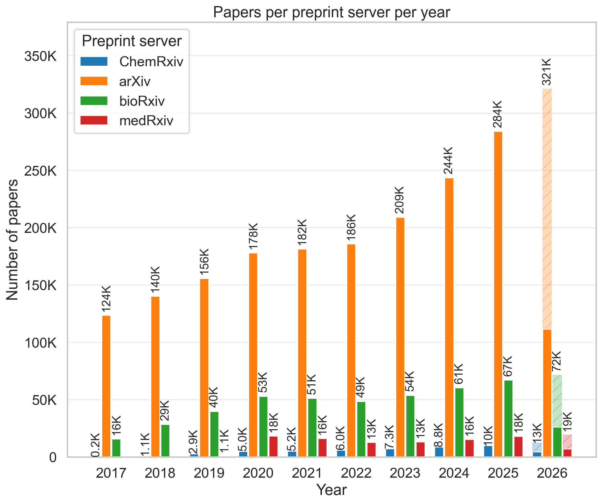

# Summary

[`paperscraper`](https://github.com/jannisborn/paperscraper) is a Python package for reproducible, source-spanning literature searches. Version `1.0.0` provides homogenized access to [PubMed](https://pubmed.ncbi.nlm.nih.gov/) and the major preprint servers [arXiv](https://arxiv.org/), [bioRxiv](https://www.biorxiv.org/), [medRxiv](https://www.medrxiv.org/), and [ChemRxiv](https://chemrxiv.org/). It queries PubMed and arXiv through their APIs, creates local JSONL snapshots for preprint servers, searches all configured sources with a common keyword interface, and writes normalized records for downstream analysis. The package also retrieves accessible PDFs or XML full text from DOI metadata, queries citation counts, estimates paper- and author-level self-citations and self-references, searches journal impact factors, and provides small postprocessing and plotting utilities.

We originally developed the package for two literature analyses [@born2021trends; @born2021on] and have since generalized it into a reusable tool for literature trend analysis, bibliometrics, and text-mining data collection.

# Statement of need

Publication searches are often performed through web interfaces. This is convenient for reading, but it is a poor fit for reproducible analyses: search syntax differs across services, metadata fields vary by source, result sets change over time, and large repeated queries can be slow or rate-limited. The problem is especially visible for preprints. A researcher mapping a field across arXiv, bioRxiv, medRxiv, and ChemRxiv, while also comparing against the peer-reviewed biomedical literature in PubMed, usually has to combine several APIs, parse different response formats, store intermediate data, and document the exact query logic.

`paperscraper` is designed for this cross-source case. To our knowledge, it is the first Python tool that lets users express one Boolean keyword query and run it in one workflow over PubMed plus arXiv, bioRxiv, medRxiv, and ChemRxiv. This makes it useful for systematic literature monitoring, research landscape studies, preprint-to-publication comparisons, and building text-mining corpora from a documented snapshot of the literature.

`paperscraper` uses a small common representation. Queries are nested keyword lists: terms at the outer level are combined with `AND`, while inner lists define synonyms combined with `OR`. Results are normalized to tabular records containing fields such as title, authors, date, abstract, journal, and DOI. The same JSONL format is used for generated dumps and query outputs, making the results easy to inspect and archive.

# State of the field

Several mature tools already solve parts of this problem. The [`arxiv`](https://github.com/lukasschwab/arxiv.py) Python package exposes the arXiv API [@arxiv_python], the [`PyMed`](https://pypi.org/project/pymed/) Python package provides access to PubMed records [@pymed], and [`scholarly`](https://github.com/scholarly-python-package/scholarly) automates [Google Scholar](https://scholar.google.com/) queries [@scholarly]. Broader scholarly infrastructure such as [Crossref](https://www.crossref.org/documentation/retrieve-metadata/rest-api/) [@crossref_api], [OpenAlex](https://openalex.org/) [@openalex], and [Semantic Scholar](https://www.semanticscholar.org/product/api) [@semantic_scholar_api] provide large-scale bibliographic metadata and citation graphs.

We do not intend `paperscraper` to replace these services. Its role is to compose them into a workflow for source-spanning publication searches and downstream analyses. Compared with source-specific clients, it adds a common query convention, local dump creation and querying for preprint servers, DOI-based full-text retrieval with fallbacks, citation and self-citation helpers, and plotting utilities aimed at literature trend analyses.

The PubMed dependency is a special case. `paperscraper` currently uses [`pymed-paperscraper`](https://pypi.org/project/pymed-paperscraper/), a maintained fork of PyMed created after the upstream project was archived in 2020. The fork exists only to keep PubMed access reliable for `paperscraper`; its release notes document fixes for request handling, article identifiers, DOI extraction, and PubMed XML formatting edge cases [@pymed_paperscraper; @pymed_paperscraper_releases].

# Software design

We organize the package around source-specific modules with shared conventions. PubMed and arXiv API clients return [`pandas`](https://pandas.pydata.org/) data frames, which can be written to JSONL using common dump helpers. `paperscraper.load_dumps` discovers available local dumps and exposes configured backends through `QUERY_FN_DICT`.

The public documentation at <https://jannisborn.github.io/paperscraper/> includes worked examples for the main workflows: paper keyword analysis, PDF retrieval, scholar metrics analysis, and self-citation analysis. These examples are the intended entry point for users and also serve as reproducible reference analyses for reviewers.

## Keyword search and local dumps

The core paper keyword analysis workflow searches normalized metadata records with the nested Boolean query convention. For bioRxiv, medRxiv, and ChemRxiv, users first create local JSONL dumps by querying the xRxiv APIs through `paperscraper.get_dumps`; this local download is a prerequisite for the package's multi-source keyword search operations and makes later analyses stable with respect to the downloaded snapshot. `paperscraper` does not redistribute these dumps because abstracts, full text, and some metadata fields can be governed by copyright, article-level reuse licenses, and platform terms of use; arXiv metadata is the exception, since arXiv applies CC0 to metadata [@nlm_copyright; @biorxiv_api; @medrxiv_tdm; @chemrxiv_terms; @arxiv_license].

For arXiv, users can either query the API or build a local dump from the [arXiv Kaggle metadata snapshot](https://www.kaggle.com/datasets/Cornell-University/arxiv). We handle local dump search through `XRXivQuery`, which reads JSONL files and applies the keyword logic over selected metadata fields; the top-level `dump_queries` helper runs one or more queries across all configured sources.

## PDF retrieval

Full-text retrieval is implemented as a best-effort DOI workflow. `save_pdf` first resolves the DOI landing page, then tries direct preprint or publisher PDF links where available. If direct retrieval fails, supported fallbacks include [BioC-PMC XML](https://www.ncbi.nlm.nih.gov/research/bionlp/APIs/BioC-PMC/), eLife XML, publisher text-and-data-mining APIs when credentials are provided, and [bioRxiv S3 requester-pays access](https://www.biorxiv.org/tdm). These methods do not bypass paywalls or publisher restrictions; they only automate retrieval paths available to the user.

## Scholar metrics analysis

Citation utilities use Semantic Scholar and Google Scholar to retrieve paper citation counts. Author-level Semantic Scholar helpers retrieve publication counts, citation counts, and h-index values, and journal metrics are exposed through a small fuzzy-search wrapper around the `impact-factor` package.

## Self-citation analysis

Citations are useful, but they are not a neutral measure of influence. Authors often need to cite their own earlier methods, data, or theory; in that ordinary form, self-citation is part of cumulative research. The problem starts when self-links become large enough to inflate citation counts or h-index values, making it harder to distinguish community uptake from metric gaming [@bartneck2011detecting; @szomszor2020how].

The citation subpackage therefore exposes self-links as inspectable quantities. A self-citation is a citation from a later paper that shares at least one author with the cited paper; a self-reference is a reference made by a paper to earlier work that shares at least one author. `paperscraper` estimates both at paper and author level using Semantic Scholar paper, citation, and reference metadata.

The bundled self-citation example applies these utilities to a small benchmark of researchers in chemistry, computer science, mathematics, medicine, and physics. It groups researchers into three cohorts: historic prize recipients, represented by Nobel Prize, Fields Medal, and Turing Award winners from 1993-1998; recent prize recipients, represented by comparable senior awardees since 2018; and rising researchers, represented by 2025 early-career or mid-career researchers selected as plausible future candidates for such prizes. The benchmark is included to demonstrate the analysis workflow and plotting utilities, not to establish a general bibliometric result; cohort definitions, field coverage, and citation-window effects all require care in substantive use.

# Research impact statement

`paperscraper` supports reproducible publication counts, source comparisons, literature monitoring, PDF/XML collection for downstream text mining, and bibliometric analyses of citation and self-citation patterns.

The project is distributed as an open-source Python package under the [MIT license](https://github.com/jannisborn/paperscraper/blob/main/LICENSE), with installation through [PyPI](https://pypi.org/project/paperscraper/), [public documentation](https://jannisborn.github.io/paperscraper/), tests, continuous integration, contribution guidelines, and project governance. The JOSS submission targets version `1.0.0`. Its examples cover keyword-based literature analysis, PDF retrieval, scholar metrics, and self-citation analysis. These examples are intended as reference workflows that can be adapted to systematic reviews, research landscape studies, and benchmark data collection.

# Research community usage

Community use spans dataset construction and retrieval-augmented generation. PEaCE used `paperscraper` to crawl ChemRxiv abstracts for chemistry OCR training data [@zhang2024peace], ChemLit-QA used it to download ChemRxiv papers as PDFs for a chemistry RAG benchmark [@wellawatte2024chemlitqa], and a virtual-agent study used it to assemble 340 scientific-literature PDFs for wellbeing support [@truong2026virtual]. ChemPile used `paperscraper` to collect ChemRxiv, bioRxiv, and medRxiv preprints and retrieve arXiv PDFs for the ChemPile-Paper subset [@mirza2025chempile]. As of 31 May 2026, the GitHub repository has 523 stars and 59 forks, PyPI lists releases from `0.0.1` through `1.0.0`, and PePy reports around 100,000 historical downloads and about 3,000 per month. To date we have ten non-author community contributors [@paperscraper_github; @pypi_paperscraper; @pepy_paperscraper].

# AI usage disclosure

OpenAI Codex, based on GPT-5, was used to assist with revising this manuscript. It was also used for targeted repository inspection and documentation edits. The authors validated all AI-assisted outputs, made the core design decisions, and are responsible for the accuracy, originality, licensing, and ethical and legal compliance of the manuscript, software, citations, and documentation.

# Acknowledgements

We acknowledge code, documentation, and design contributions from Matteo Manica, Nicolas Mathis, Rui Meng, Ashish Chouhan, Joris Cadow-Gossweiler, Daniel Probst, Lukas Schwab, Julius Bier Kirkegaard, Davide Gotta, and Yaroslav Halchenko. We thank Andrew White for the idea of adding self-citation analyses. We also thank the maintainers of the upstream services and Python packages on which `paperscraper` depends.
